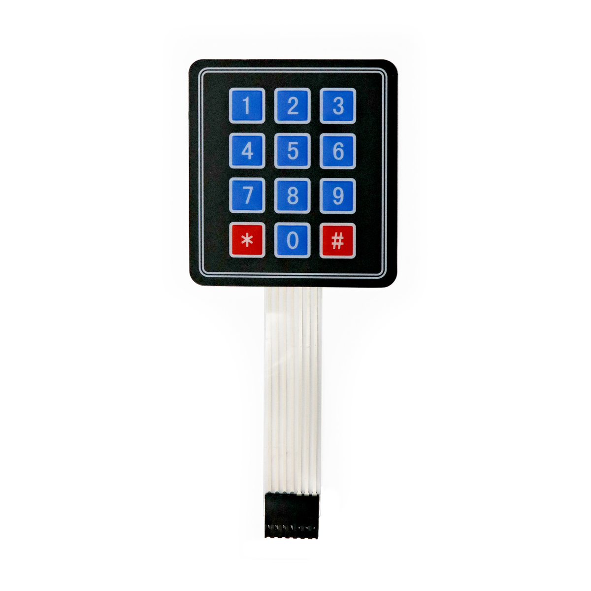

---
title: "Tastenfeld"
date: "2018-10-01T14:47:07.000Z"
tags: 
  - "sensor"
coverImage: "58_tastenfeld.jpg"
material_number: "58"
material_type: "sensor"
material_short_descr: "Membrane 3x4 Matrix Keypad + Extras 3x4"
manufacture: "Adafruit"
manufacture_url: "https://www.adafruit.com/"
repo_name: "mks-Adafruit-Membrane_3x4_matrix_keypad"
product_url: "www.adafruit.com/product/419"
clone_url: "https://github.com/Make-Your-School/mks-Adafruit-Membrane_3x4_matrix_keypad.git"
repo_prefix: "mks"
repo_part: "Membrane_3x4_matrix_keypad"
embedded_example_file: "examples/Membrane_3x4_matrix_keypad_minimal/Membrane_3x4_matrix_keypad_minimal.ino"
---

# Tastenfeld

## Beschreibung
Das Tastenfeld verfügt über zwölf Tasten, die als Eingabe für jegliche Elektronik-Projekte eingesetzt werden können. Das Tastenfeld lässt sich über sieben digitale Anschlusspins eines Arduinos oder Raspberry Pis ausglesen. Es ist sehr dünn und verfügt über eine selbsthaftende Rückseite, sodass das Tastenfeld sehr leicht aufgeklebt werden kann.

Das Tastenfeld findet beispielsweise als Eingabebereich für einen selbstgebauten Automaten Verwendung.

Alle weiteren Hintergrundinformationen sowie ein Beispielaufbau und alle notwendigen Programmbibliotheken sind auf der Produktseite zusammengefasst. Zusätzlich findet man über alle gängigen Suchmaschinen meist nur mit der Eingabe der genauen Komponenten-Bezeichnungen.

https://www.youtube.com/watch?v=KKbfTAG5HsU

<!-- infolist -->
## Wichtige Links für die ersten Schritte:

- [Adafruit Tastenfeld](https://www.adafruit.com/product/419)

## Projektbeispiele:

- [Funduino - Digitales Schloss](https://funduino.de/tastenfeld-schloss)

## Weiterführende Hintergrundinformationen:

- [GPIO - Wikipedia Artikel](https://de.wikipedia.org/wiki/Allzweckeingabe/-ausgabe)
- [GitHub-Repository: Tastenfeld](https://github.com/MakeYourSchool/58-Tastenfeld)

