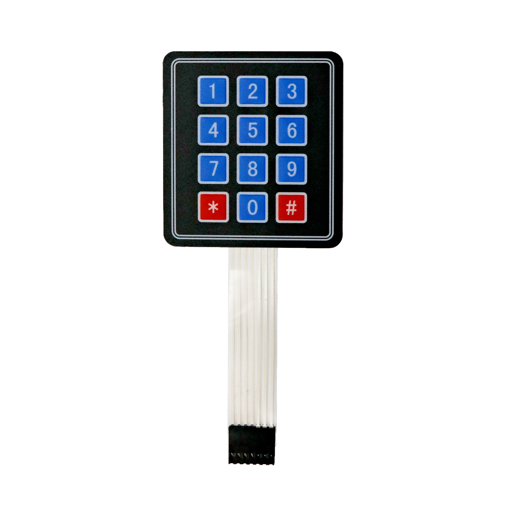
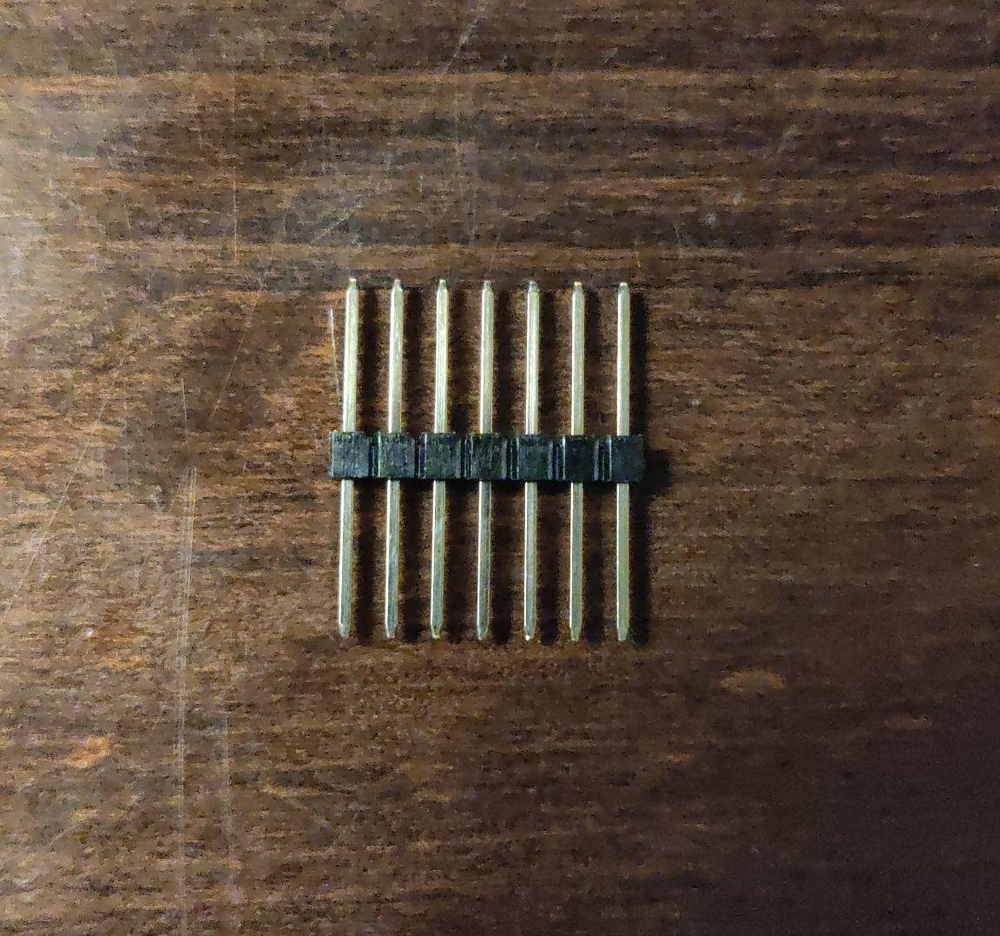
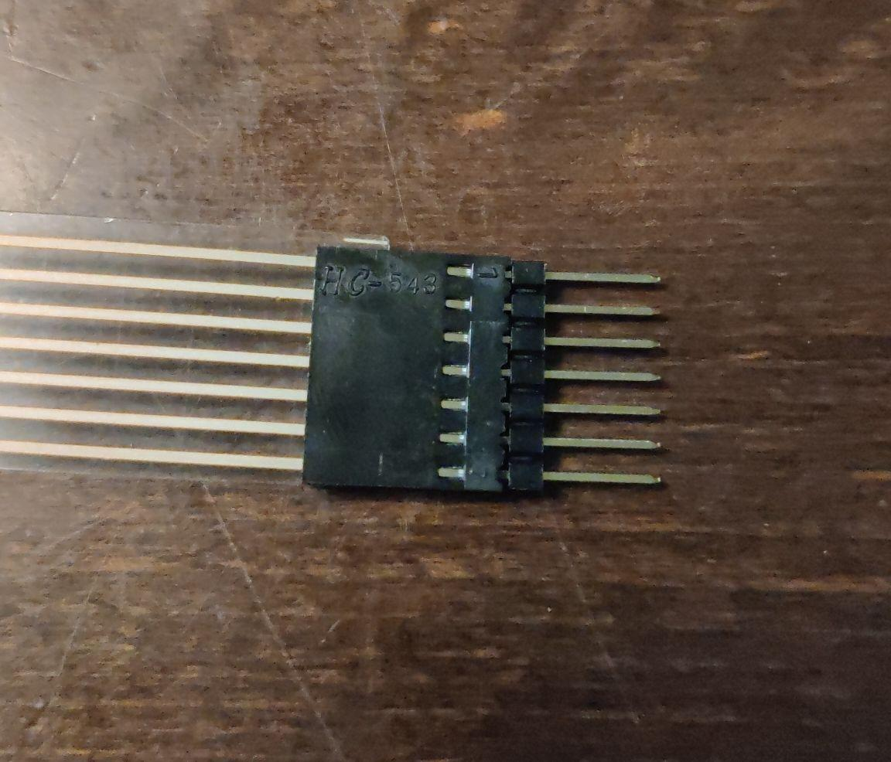
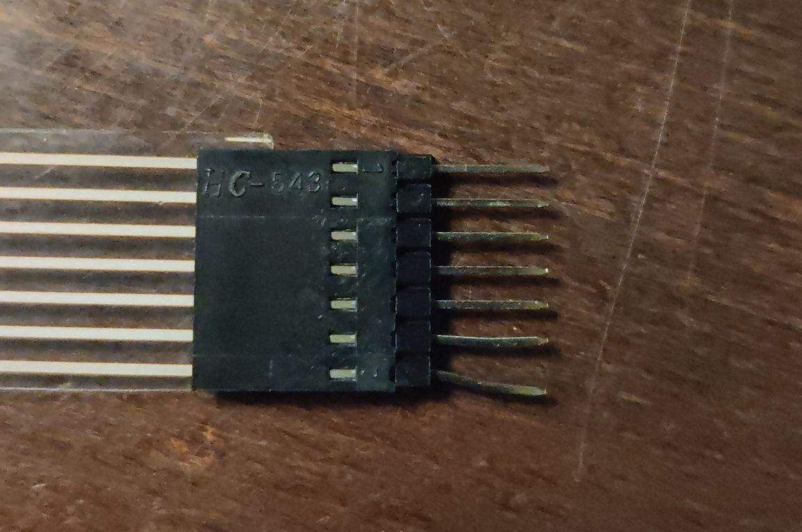
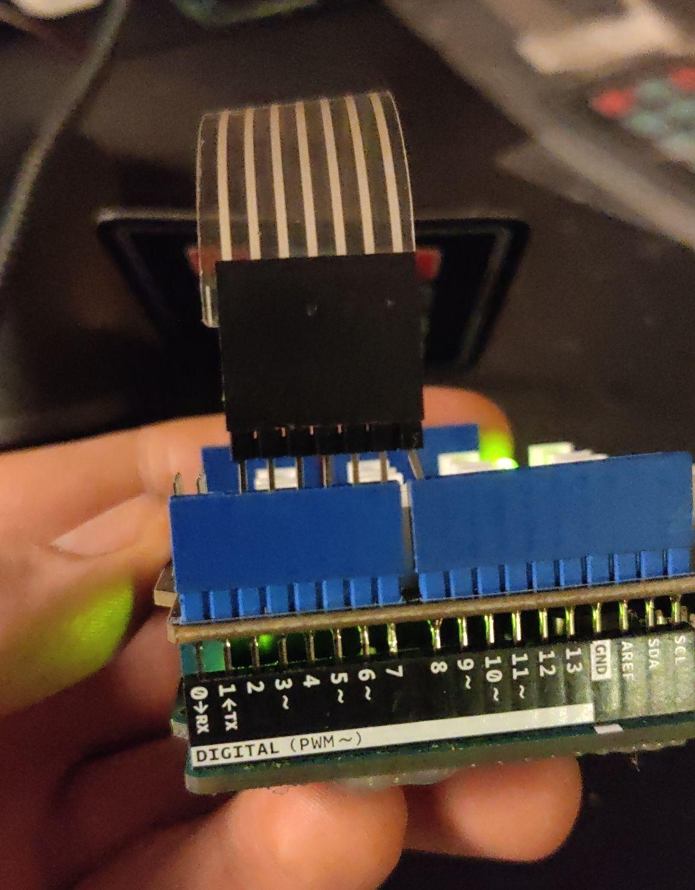
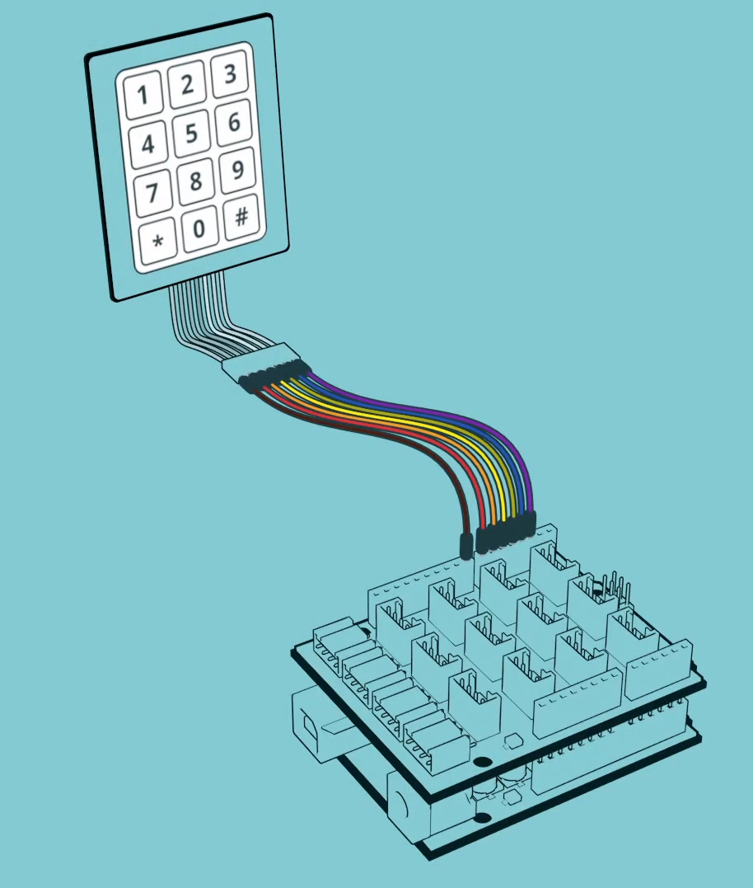

# Tastenfeld

## Beschreibung

Tastenfelder sind überall. Digital in Handys, an Snackautomaten am Bahnhof oder an Türen mit Zahlencode. Dieses Tastenfeld hat insgesamt zwölf Tasten, die als Eingabe für jegliche Elektronik-Projekte eingesetzt werden können. Das Tastenfeld lässt sich über sieben digitale Anschlusspins eines Arduinos oder Raspberry Pis ausglesen. Es ist sehr dünn und verfügt über eine selbsthaftende Rückseite, sodass das Tastenfeld sehr leicht aufgeklebt werden kann.

### Video

@[youtube](https://www.youtube.com/watch?v=KKbfTAG5HsU)

## Anleitung

1. Nehme dir das Tastenfeld und dazu am besten folgenden kleinen Konnektor (siehe Bild). Wenn du keinen finden kannst, dann suche dir sieben bunte Kabel (male / male) und mache bei Schritt 4 weiter.  

1. Stecke diesen Konnektor in den Kontakt des Tastfeldes rein, sodass sieben Stecker herausgucken.  

1. Biege vorsichtig einen der Pins zur Seite, sodass es etwa so aussieht. Im nächsten Schritt siehst du, warum es das braucht.  

1. Stecke diesen Konnektor des Tastfelds in die Pin-Buchsen and der Seite des Arduinos (oder in des Grove-Shields, es geht beides) in die Pins `2` bis `8`. Falls du vor hast viele andere Sachen an den Arduino anzuschließen, verwende z.B. stattdessen die Pins 7 - 13 und aktualisiere den Code. Damit bleiben die Grove Stecker unbelegt.
  
Mit Kabeln würde es in etwa so aussehen:  

1. Gehe in die Arduino IDE und klicke am linken Rand der Arduino IDE auf den Knopf mit Büchersymbol (das ist der Bibliotheksverwalter) und suche nach `Keypad`, klicke anschließend auf installieren. Das ist eine Bibliothek mit Code, damit man das Tastenfeld leicht bedienen kann.
1. Gehe in der Arduino IDE oben auf `Werkzeuge` und klicke auf `Serieller Monitor`. Dadurch öffnet sich unten ein Fenster, wo man Nachrichten vom Arduino auf dem Laptop sehen kann.
1. Nehme einer der  Beispielcodes von unten und lade ihn auf den Arduino. Drücke nun auf den Tasten des Tastenfelds herum und siehe im Seriellen Monitor, ob es funktioniert!

## Beispiele

!!!show-examples:./examples/

<!-- infolist -->

## Wichtige Links für die ersten Schritte:

Alle weiteren Hintergrundinformationen sowie ein Beispielaufbau und alle notwendigen Programmbibliotheken sind auf der Produktseite zusammengefasst. Zusätzlich findet man über alle gängigen Suchmaschinen meist nur mit der Eingabe der genauen Komponenten-Bezeichnungen.

- [How to Set Up a Keypad on an Arduino](https://www.circuitbasics.com/how-to-set-up-a-keypad-on-an-arduino/) (Englisch)
- [Interface 4×3 & 4×4 Membrane Keypad with Arduino](https://lastminuteengineers.com/arduino-keypad-tutorial/) (Englisch)

## Projektbeispiele:

- [Funduino - Digitales Schloss](https://funduino.de/tastenfeld-schloss)

## Weiterführende Hintergrundinformationen:

- [Adafruit Tastenfeld](https://www.adafruit.com/product/419)
- [GitHub-Repository: Tastenfeld](https://github.com/MakeYourSchool/58-Tastenfeld)

